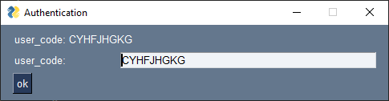
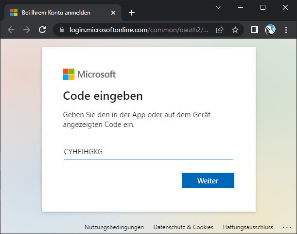
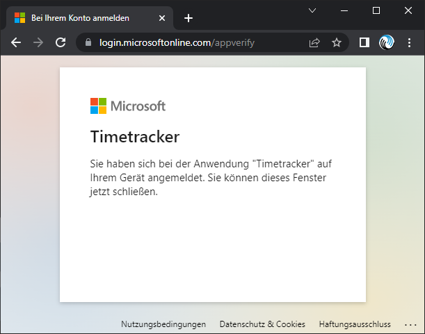
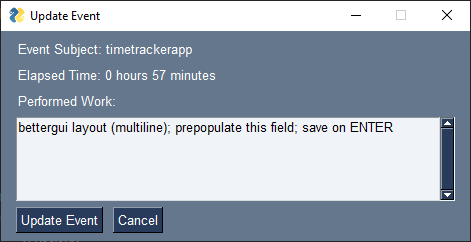
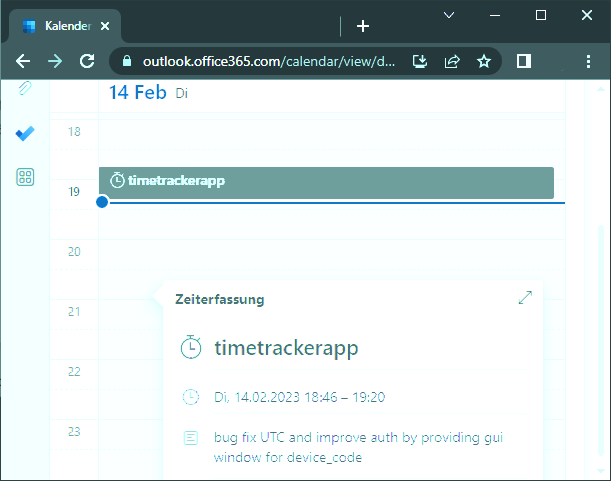
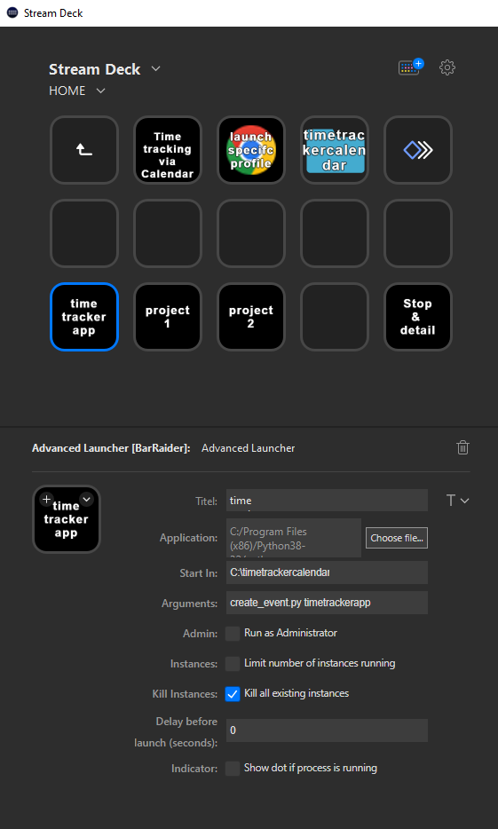

# Project Time Tracking using Calendar Events

## Requirements and Functionality

- integrate with calendar
- only use standard calendar features
- use standard calendar to modify entries or add entries afterwards
- use from my PC computer only, no need for mobile app
- use my existing StreamDeck, so it is in my face and does not need extra screen estate

- start time logging
	- press button on StreamDeck. one button per project (they don't change that often and there are not that many)
	- pass project name as command line argument (makes it easy to change)
  - use currenct time as start time (i want it accurate to the minute)
	- use projectname as titel and tag
  - create calendar event with duration of 2 hours (just to be safe, it is already online)
	- store the ID of the created event localy
- stop logging
	- show popup with titel and current_time - start_time duration
  - ask me for details about the work in this simple popup window
  - UPDATE event(eventId) with current_time as end_time and comment as body.content

## Usage

1. setup app in [azure](https://developer.microsoft.com/en-us/graph/quick-start?state=option-python) and copy the `APP_ID` into the `config.cfg`
2. create an extra outlook calendar (if you don't want to use the default one)
3. install py modules `python -m pip install -r requirements.txt`
4. run `python get_calendar_id.py` and get the `id` for the desired calendar into `config.cfg`
5. run `python create_event.py "timetrackerapp"` to start tracking time
6. -- authenticate as needed with account you want to use (manually copy user_code to browser)



7. run `python modify_event.py` to stop the tracking and enter details of what you did

8. marvel at the calendar that is now even busier than before


## Export logged Events

1. run `python export_events.py --subject timetrackerapp --months all	`
2. receive output in console (or pipe to whatever/whereever you want)
```bash
account connected!
Received a total of 8 events

2023-02-14;  0h34; timetrackerapp; ; bug fix UTC and improve auth by providing gui wind;
2023-02-17;  2h02; timetrackerapp; ; added streamdeck support;
2023-03-05;  3h05; timetrackerapp; ; working on auth session renew;
2023-03-19;  0h08; timetrackerapp; ; msal token refresh cache. commit + github;
2023-04-01;  2h00; timetrackerapp; ; ;
2023-04-02;  1h02; timetrackerapp; ; bettergui layout (multiline); prepopulate this fie;
2023-04-03;  2h43; timetrackerapp; ; export events csv style;
2023-09-10;  2h00; timetracker; ; ;

Total time: 13 hours, 36 minutes

```
3. run `python export_events.py` without arguments to get entire list of events (could be a long list)
4. run `python export_events.py --help` for command line options and usage

## Usage with Streamdeck

Streamdeck by Elgato is a fancy shortcut keyboard with configurable screen an buttons.
Made for Video Streamer, i use it extensively for repetive work (starting virtual machines and configuring them, ssh-ing into server to update packages,..), becasue this little thing sits on my desktop anyways.

and now i use it to also track time. there is a button for every single project i am working on. once pressed it *start logging* this project (remember it's just a command line parameter that defines the project_name).

and there is one button to *stop the last created* calenderevent and lets me input details about what i did. note that i modify the file to use `pyw` extension and run it with `pythonw.exe` - this allows me to run the modify command without seeing ugly command line prompts.

i still use `py` with terminal opening up, because that way i know that it worked.




setting it up was not the most straigth forward thing. because the py script needs to run in the py scrip directory (because it uses other files). BarRaider made an awesome [advanced app launcher](https://github.com/BarRaider/streamdeck-advancedlauncher) that lets you set the *directory* and the *arguments* for the script.


## gmail
Using *gmail* sounded like the simplest answer:
there is a good API description and [python code examples](https://developers.google.com/calendar/api/v3/reference/events/insert#examples)
it links to Python [quickstart](https://developers.google.com/calendar/quickstart/python) on how to setup the environment.

and that is where i stopped, because it asked for a *google cloud project* and a *google workspace*. it sounded too complicated and like something that might ask for my credit card.

## outlook
since i use *Microsoft365* (shame on me: it should be an FOSS solution, but oh my) let us try this.
Looks like i need to the use *Graph REST API*. [Documentation](https://learn.microsoft.com/en-us/graph/api/event-update?view=graph-rest-1.0&tabs=http) is straight forward.
but.... code examples are not available in python.
and... it turns out you need an Azure account, not just win365, plus you need to register the app plus configure a bunch of things. looks like the app-creator needs to register the app. plus the user still needs to login - what happened to good old app access keys? alternatively i could create a dameon- but that one could access everything in my organziation, not just my information.


## chatGPT
chatGPT to the rescue! Let us play and see what it can do.
took me 10 minutes to ask for code step by step. (dry run, i did not dare to actually try it just yet.)
conversation is available here: *chatPGT_conversation.md*

## authentication
the chatGPT generated authentication part is wrong and not working.
running [tutorial](https://learn.microsoft.com/en-us/graph/tutorials/python) and [quickstart](https://developer.microsoft.com/en-us/graph/quick-start?state=option-python) provides a nice setup of the azure project... but the code example is complex and i can not get to the deviceId to post to the user (only on command line).

the following example was not working - but after i set up the azure project via the quickstart, it seems to work.
[example from learndataanalysis.org](https://learndataanalysis.org/source-code-create-and-delete-outlook-calendar-events-using-microsoft-graph-api-in-python/)
and it remembers the user and does not ask for login data every time.

display acces token and decode content online: https://jwt.ms/  (for debug reasons only)

## my take away
1. chatGPT is awesome. it made it look easy enough that i started the project
2. web authentication sucks. API changes all the time (azure graph, ms graph, MSAL, access_tokens). serverside aint straight forward either - read up on that stuff, and expect to spend half a day. it took me about 7hours to get the authentication working - without any experience on that topic.
3. google is still your friend. look for code examples for a given topic. i cloned and started 3 git repos from different sources to see how it works and which one actuallly worked with the server.
4. testing would be nice. thought this app is simpe enough to do without testing... but when changing to config.cfg it messed up the scope and i did not notice till much later.
5. chatGPT code is very buggy. variables that get reused for different purposes, plain wrong info, timezone madness with different libraries, format conversion misunderstanding, syntax issues so it throws error when running,... 5hours to iron out all the stuff that i did not know i need to know.
6. user still needs to know how to debug, research and google, read an API doc, and generally understand what code does
7. chatgpt is a nice companion to have. it is definetly friendlier than stackoverflow. and it never makes you feel dumb and it never insults you.

## environment
i run this on a Win10 machine. Python 3.8.0
